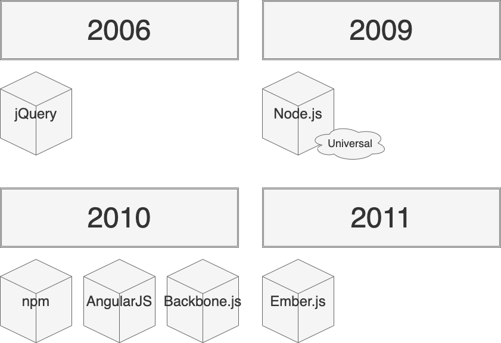
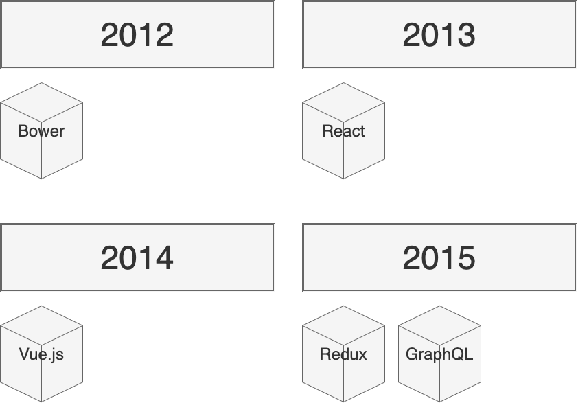
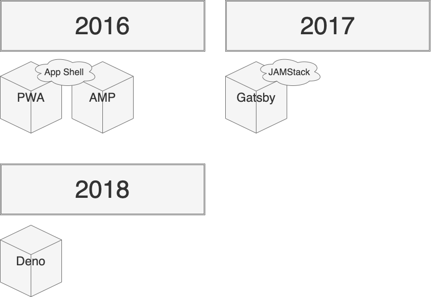

# フロントエンドソフトウェアの歴史 {#history-of-frontend-software}

[2006年、jQueryの誕生](https://en.wikipedia.org/wiki/JQuery)により、フロントエンドの開発は加速する。
主に、次の2つがjQueryの素晴らしいところだ。

* DOM操作やイベント処理が容易
* ブラウザ間の非互換性をサポート

[2009年、Node.jsが誕生](https://en.wikipedia.org/wiki/Node.js)した。
Node.jsは、V8Javascriptエンジン上に構築されたJavascript実行環境の1つである。
サーバサイドでJavascriptを動かすことができるため、 Universal JavaScript（Isomorphic JavaScript）が実現できる。
つまり、クライアントもサーバサイド両方ともJavascriptで構築できるということだ。
イベント駆動型プログラミング言語であるNode.jsは、[C10K問題](https://en.wikipedia.org/wiki/C10k_problem)を解決する。

[2010年、npmが誕生](https://en.wikipedia.org/wiki/Node.js)した。
フロントエンドパッケージの中央リポジトリであり、現在100万を超えるパッケージがある。

jQueryの開発の加速後、課題が見えてきた。一貫したデータの管理・処理する機能がないところだ。
AngularJS、Backbone.js、Ember.jsのようなクライアントサイドにおけるMVCアーキテクチャが話題となる。
AngularJSから、AngularJS2への移行に互換性がないため、Angularユーザは激怒した。

[2012年、Bowerが誕生](https://github.com/bower/bower/blob/master/CHANGELOG.md)した。
Bowerは、フロントエンドにおけるパッケージマネージャーを管理する。
執筆当時（2021年3月時点）のBower公式によると、YarnやWebpackを使用することをお勧めされている。

[2013年、Reactが誕生](https://en.wikipedia.org/wiki/React_%28JavaScript_library%29)した。

