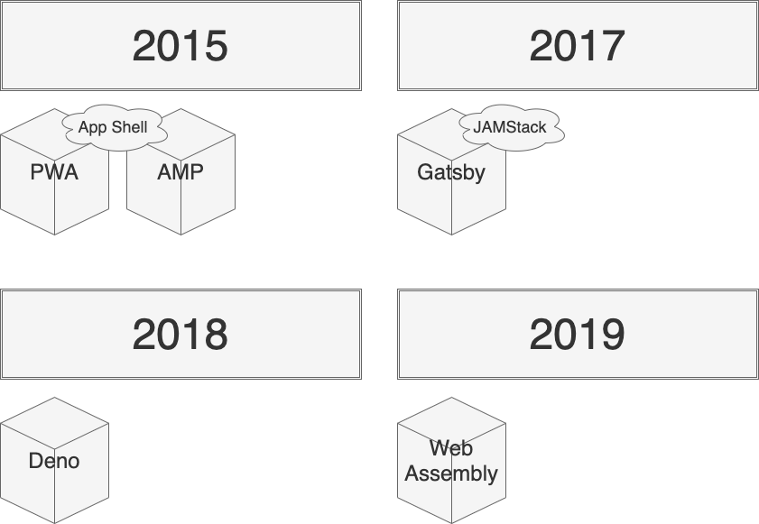

# フロントエンドソフトウェアの歴史 {#history-of-frontend-software}
## 2006年~2011年{#2006-2011}

[2006年、jQueryの誕生](https://en.wikipedia.org/wiki/JQuery)により、フロントエンドの開発は加速する。
主に、次の2つがjQueryの素晴らしいところだ。

* DOM操作やイベント処理が容易
* ブラウザ間の非互換性をサポート

[2009年、Node.jsが誕生](https://en.wikipedia.org/wiki/Node.js)した。
Node.jsは、V8Javascriptエンジン上に構築されたJavascript実行環境の1つである。
サーバサイドでJavascriptを動かすことができるため、 Universal JavaScript（Isomorphic JavaScript）が実現できる。
つまり、クライアントもサーバサイド両方ともJavascriptで構築できるということだ。
イベント駆動型プログラミング言語であるNode.jsは、[C10K問題](https://en.wikipedia.org/wiki/C10k_problem)を解決する。

[2010年、npmが誕生](https://en.wikipedia.org/wiki/Node.js)した。
フロントエンドパッケージの中央リポジトリであり、現在100万を超えるパッケージがある。

jQueryの開発の加速後、課題が見えてきた。一貫したデータの管理・処理する機能がないところだ。
AngularJS、Backbone.js、Ember.jsのようなクライアントサイドにおけるMVCアーキテクチャが話題となる。
AngularJSから、AngularJS2への移行に互換性がないため、Angularユーザは激怒した。

## 2012年~2015年{#2012-2015}

[2012年、Bowerが誕生](https://github.com/bower/bower/blob/master/CHANGELOG.md)した。
Bowerは、フロントエンドにおけるパッケージマネージャーを管理する。
執筆当時（2021年3月時点）のBower公式によると、YarnやWebpackの使用をお勧めされている。

[2013年、Reactが誕生](https://en.wikipedia.org/wiki/React_%28JavaScript_library%29)した。
仮想DOMや、一方向データフロー、Fluxといった機能が登場した。
これらは、従来のフロントエンド開発におけるデータバインディングの課題を解決する。
仮想DOMによって、データ更新に伴うレンダリングが差分更新となり、パフォーマンスが向上する。
Fluxによって、状態は唯一の情報源として扱い、一方向データフローを管理できるようになった。

[同年、Hugoが誕生](https://en.wikipedia.org/wiki/Hugo_%28software%29)した。
Hugoは、Go製のSSG（Static Site Generators）である。
次の2つの特徴をもつ。

* 生成する元データは、HTMLだけでなくMarkdownもサポート
* i18n（internationalization and localization）をサポート

手軽に、かつ素早く静的コンテンツを生成できるようになり、[様々な形態](https://gohugo.io/showcase/)に活用された。

[2014年、Vue.jsが誕生](https://en.wikipedia.org/wiki/Vue.js)した。
GoogleでAngularJSを使用していたEvan Youによって、Vue.jsが開発された。
それには、プログレッシブフレームワークという特性があり、段階的に導入できるメリットがある。
React.jsとは違い、それはコンポーネントに焦点があたっている。
そのため、コアライブラリは、コンポーネントに関するもので、ルーティングや状態管理はサポートライブラリと区分けされている。

[2015年、Reduxが誕生](https://en.wikipedia.org/wiki/Redux_%28JavaScript_library%29)した。
Fluxアーキテクチャの影響により、状態管理のライブラリとしてReduxが生まれた。
Reactから切り離されているため、他のライブラリでも使用可能となる。
また、Reduxの影響により、Angularはngrx、Vue.jsはVuexというライブラリが派生する。

[同年、GraphQLが誕生](https://en.wikipedia.org/wiki/GraphQL)した。
GraphQLは、API向けのクエリ言語である。
クライアント側から要求するデータ構造を定義できるため、サーバ側は必要以上のデータを返却しなくて済む。
そのような柔軟性は、多種多様なデータをもつサービスには効果的である。

## 2015年~2019年{#2015-2019}

[2015年、AMPが誕生](https://en.wikipedia.org/wiki/Accelerated_Mobile_Pages)した。
AMP（Accelerated Mobile Pages）は、モバイルページのブラウジング最適化がされ、ページ読み込みの高速化を目的とする。
[2015年にAMP](https://blog.google/products/search/introducing-accelerated-mobile-pages/)が発表される。
[翌年、Googleモバイル検索結果](https://blog.amp.dev/2016/02/24/amping-up-in-google-search/)へ表示されるようになる。

[2015年、PWAが誕生](https://infrequently.org/2015/06/progressive-apps-escaping-tabs-without-losing-our-soul/)した。
PWA（Progressive Web Apps）は、ネイティブアプリと同様のユーザ体験をWebアプリにも拡張する。
これにより、ネイティブアプリとWebアプリの境界がなくなりつつある。

PWA、AMPの両方に関係するキーワード『モバイルファースト』がある。
2007年にiPhoneが販売され、モバイル端末でWebへアクセスできるようになる。
デスクトップ、タブレット、モバイルとさまざまな端末に対応するため、2012年にレスポンシブデザインが可能となる。
[メディアクエリ](https://www.w3.org/TR/2012/REC-css3-mediaqueries-20120619/)である。
2019年の第1四半期では、モバイルデバイス（タブレットを除く）は世界のWebサイトトラフィックの48.71％というデータがある。
詳しくは、[こちら](https://www.statista.com/statistics/271405/global-mobile-data-traffic-forecast/)を参照。
2020年近年では、Core Web Vitalsというモバイルフレンドリーを評価するための指標も発表されている。

[2017年、Gatsbyが誕生](https://github.com/gatsbyjs/gatsby)する。
Gatsbyは、Reactを使ってWebサイトやWebアプリを高速に構築できる。
Reactの機能を完全にサポートしているため、SSGだけではなく動的なコンテンツも提供できる。
また、このライブラリからJAMStackという考え方が話題になる。
JAMStackは、WebアプリやWebサイトを構築するアーキテクチャである。
JAMは、Javascript、API、Markupの頭文字を取っている。
Wordpressのようにデータベース参照しないため、フロントエンドとバックエンドを明確に分離できる。

[2018年、Denoが誕生](https://en.wikipedia.org/wiki/Deno_%28software%29)する。
Node.js開発者であるライアン・ダールより、[Node.jsに関する10の反省点](https://www.youtube.com/watch?v=M3BM9TB-8yA)という発表があった。
それら反省点より改善されたDenoが生まれた。
特にセキュリティや生産性の面に改善されているようだ。

TODO: WebAssembly