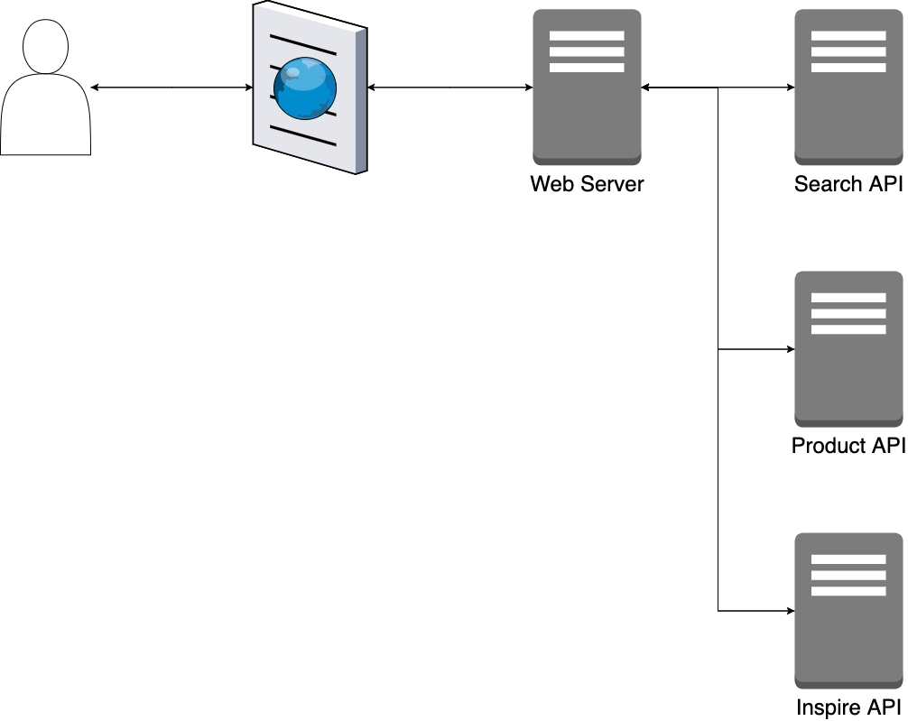

# マイクロフロントエンド {#micro-frontends}
## 概要 {#overview-of-micro-frontends}

マイクロフロントエンドは、マイクロサービスの考え方をフロントエンドに拡張した考え方だ。
次の図は、Michael Geers氏の[Micro Frontends - micro-frontends.org](https://micro-frontends.org/)より引用する。

<!-- textlint-disable -->

<!-- textlint-enable -->

モノリシックなアプリケーションからはじまり、フロントエンドとバックエンドが分離され、バックエンドのマイクロサービス化と変化している。
その変化は、次のリンクで説明してる。

* [Webシステムアーキテクチャの歴史](../history/03_history_of_web_system_architecture.md) 

バックエンド領域がマイクロサービス化されているが、依然フロントエンド部分はモノリシックなままだ。

<!-- textlint-disable -->

<!-- textlint-enable -->

そこで、フロントエンド部分もマイクロサービス化する。

## モノリスフロントエンドの課題 {#issues-of-monolithic-frontends}

なぜフロントエンド部分もマイクロサービス化するのか。
それは、次の2点がモノリスなフロントエンドの課題と筆者は考えている。

1. フロントエンド領域の変化が激しく、追従することが困難
2. システム・組織のスケールに、フロントエンドがボトルネック

### 課題1. フロントエンド領域の変化が激しく、追従することが困難 {#front-end-areas-are-changing-rapidly}

1つ目は、[フロントエンドソフトウェアの歴史](../history/02_history_of_frontend_software.md) を見て分かるとおり、フロントエンド領域の変化は激しい。
それは、次の3要素が複合しているからだと推測する。

* **利用者側の要求変化**
* **開発者側の要求変化** 
* **自由度の高いWebというプラットフォーム**

モノリスなフロントエンドだと、技術の進化に追従することは困難だ。
適切にアプリケーション設計（インタフェース設計）を維持しなければ、新たな技術を取り込むのにビックバンリリースをせざる得ない状況に陥る。
**新たな技術を取り込むことは大切なこと**であり、それは**外界の変化に追従しないといけない**からだ。

### 課題2. システム・組織のスケールに、フロントエンドがボトルネック {#front-end-is-the-bottleneck}

2つ目は、[Webシステムアーキテクチャの歴史](../history/03_history_of_web_system_architecture.md) の最後に書いたとおりだ。

まず、システムは、サービスの成長に安定したサービス提供を維持しなければならない。

フロントエンドがモノリスであると、部分的な機能に対してスケールできず、モノリス全体でスケールするしか方法がない。
たとえば、Next.jsでECサイトを1つのWebサーバに構築する。
そのサイトの中で、検索、推薦、商品表示の3つの機能を提供するページがあるとする。

これら3つの内、検索結果の**サーバーサイドレンダリング**が起因してレスポンスタイムが遅延した場合、次のような解決手段が挙げられる。

1. サーバーサイドレンダリングのアプリケーションチューニング
2. Webサーバ前段に、キャッシュレイヤーを設置
3. 稼働するWebサーバ自体のスケールアウトorスケールアップ

1番目は、アプリケーションの複雑さを増してしまう可能性がある。
2番目は、応急手当であり、抜本的な解決ではない。
3番目は、検索以外の機能は、潤沢すぎるマシンリソースになる。

この内、3番目の解決手段にフォーカスしたい。
お金で解決できるならば、3番目の手段は単純で、かつ、効果的なためよい。
さらにいえば、検索・推薦・商品表示のフロントエンド部分を分離できれば、尚よいだろう（それがマイクロフロントエンドだ）。
必要な機能のみスケールアウトorスケールアップすればよい。

次に組織は、短い開発サイクルで施策を打ち出し、継続的なフィードバックを得る必要がある。
<!-- textlint-disable -->
そのためには、開発者は高速に開発を進めなければならない。
<!-- textlint-enable -->
しかし、モノリスなフロントエンドの場合、難しいことがある。
それは、次の点が挙げられる。

* 幅広い知識（ドメイン）が要求される
* 全体バランスを整える高度な設計が要求される
* 調査やテストの奥深さが要求される

これらを満たす**エンジニアの育成・採用することは、困難**だ。

## 背景 {#background-of-micro-frontends}

マイクロフロントエンドの考え方には、組織に関する背景がある。
それは、縦割り組織、所謂[CFT（Cross Functional Team）](https://en.wikipedia.org/wiki/Cross-functional_team)である。
CFTは、共通の目標を持った、異なる専門性をもつ人々のグループを指す。
自主的に行動し、効率的にコラボレーションすることで、創造性のレベルを高めることができる。
異なる専門性とは、次のようなケースがある。

* デザイナー
* フロントエンド（クライアント）
* バックエンド（サーバーサイド）
* データサイエンティスト
* データエンジニア
* インフラエンジニア

フロントエンドのエンジニアはUI/UXに関心があるが、データには比較的、専門性が低い。
そこで、データエンジニアとコラボレーションすることで、表現できるUI/UXのバリエーションを増やすことが可能となる。

## マイクロフロントエンドのメリット・デメリット {#merit-and-demerits-of-micro-frontends}

* メリット
  * 独立性
    * 任意のテクノロジーと任意のチームで開発可能
  * 展開
    * 特定の機能をエンドツーエンド（バック、フロント、デプロイ）で確実に実行可能
  * 俊敏性
    * 特定のドメインについて最高の知識をもつチーム間で作業を分散すると、リリースプロセスが確実にスピードアップして簡素化される
    * フロントエンドとリリースが小さいということは、リグレッションテストの表面がはるかに小さいことを意味する
      * リリースごとの変更は少なく、理論的にはテストに費やす時間を短縮できる
    * フロントエンドのアップグレード/変更にはコストが小さくなる
  * サービスの<b>専門性</b>向上
    * ex. 対象サービスのフロントエンドだけに集中できる
  * サービスの<b>開発速度</b>向上
    * ex. 対象サービスのソースコードだけ読めばよい
    * ex. 対象サービスだけにライブラリアップデートすればよい
    * ex. フレームワークの切り替えは対象サービスだけすればよい
* デメリット
  * 独立性
    * 独立できず、相互接続しているチームが存在しがち
    * 多くの機能で複数のマイクロフロントエンドにまたがる変更が必要になり、独立性や自律性が低下
    * ライブラリを共有すること自体は問題ないが、不適切な分割によって作成された任意の境界を回避するための包括的な場所として使用すると、問題が発生する
    * コンポーネント間の通信の構築は、実装と維持が困難であるだけでなく、コンポーネントの独立性が取り除かれる
    * 横断的関心ことへの変更ですべてのマイクロフロントエンドを変更することは、独立性が低下する
  * 展開
    * より大きな機能の部分的な実装が含まれているため、個別にリリースできない
    * サイト全体のCI/CDプロセス
  * 俊敏性
    * 重複作業が発生する
    * 検出可能性が低下した結果、一部の標準コンポーネントを共有できず、個別のフロントエンド間で実装が重複してしまう
    * 共有キャッシュがないと、各コンポーネントは独自のデータセットをプルダウンする必要があり、大量の重複呼び出しが発生する
  * パフォーマンス
    * マイクロフロントエンドの実装に不適切な場合、パフォーマンスの低下がある
  * 特定チームが改善しても、チーム全体が改善しない
    * ex. あるチームがWebpackのビルド時間短縮に成功しても、他のチームは影響を受けない
    * ex. すべてのチームが採用しているライブラリのセキュリティパッチは、それぞれのチームが更新しなければならない
  * チーム全体へ共有する仕組みを考える必要がある
    * ex. デザインシステム、パフォーマンス、ナレッジ
  * エッジな技術スタック採用は、チームメンバー移動を困難にする
    * ex. パラダイムシフトが発生してしまう技術スタック
