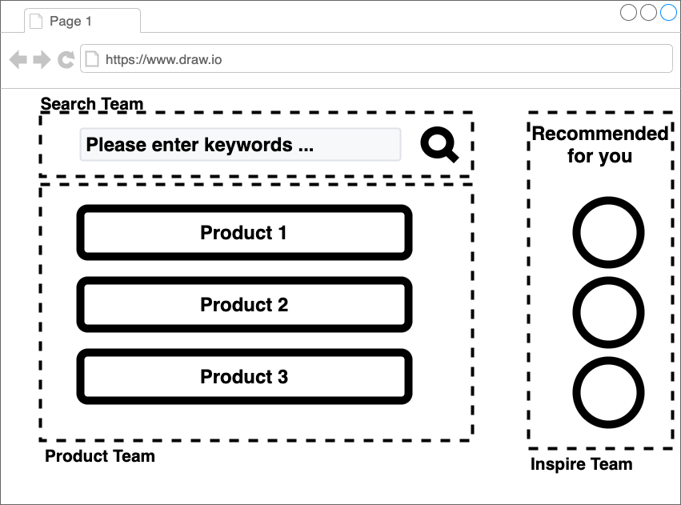
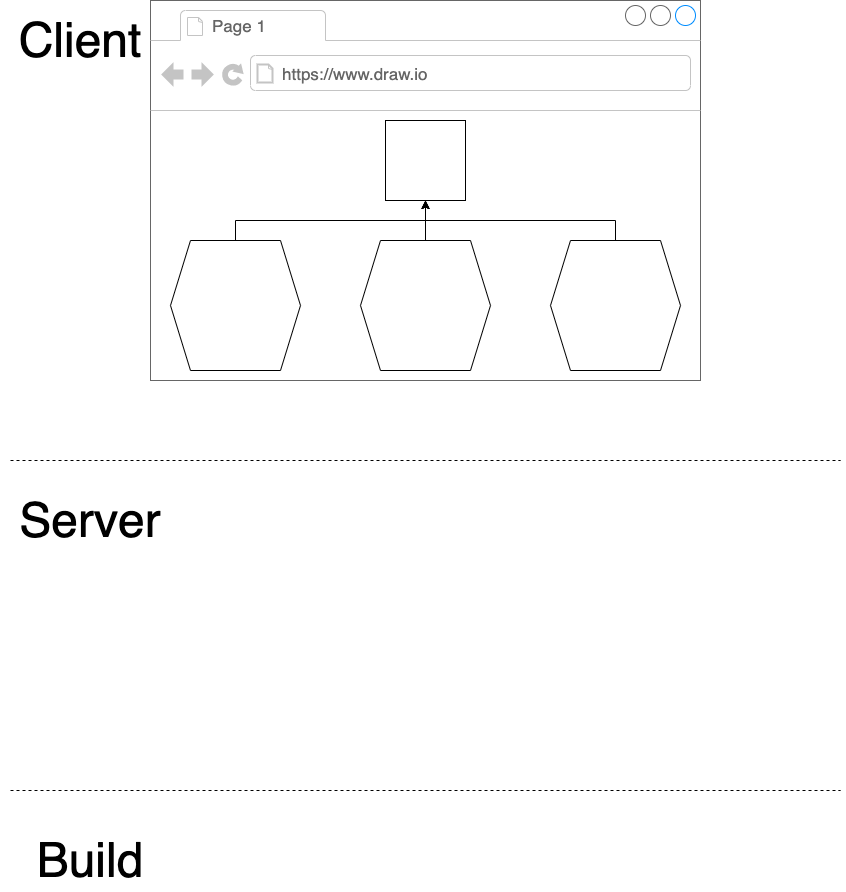
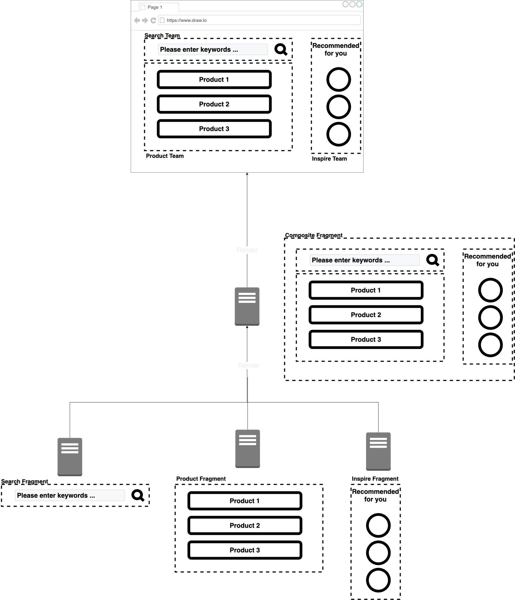
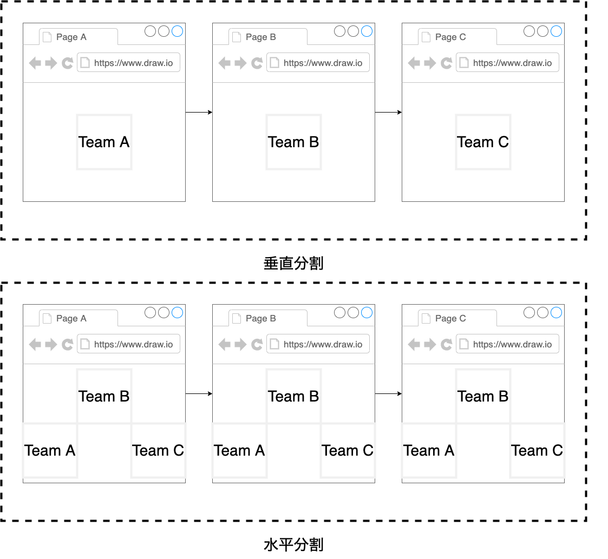

# マイクロフロントエンドの組成パターン {#composite-pattern-of-micro-frontends}

本章では、実際にマイクロフロントエンドを構築する際の組成パターンについて紹介する。

## 前提 {#premise}

とあるECサイトを3つのチームでアプリケーション開発すると想定する。

* Search Team
  * Productを検索する
* Product Team
  * Productを魅せる
* Inspire Team
  * Productへの購買意欲を高める

これらのチームは、バックエンドからフロントエンドまで1チームで構成されている。
フロントエンドは、フラグメント（HTML,CSS,JS）を提供する。

## クライアントサイド組成パターン {#client-side-composition}

クライアントサイドレンダリングするタイミングで、組成する。
一番わかりやすい例が、iframeやWeb Componentsである。
各フロントエンドチームのフラグメントを、ブラウザ上で組成する。
もっとも簡単な手段は、iframeを使うことだ。

### メリット・デメリット {#merit-and-demerits-of-client-side-composition}

* メリット
  * Web標準技術のみで実現可能
  * iframeやシャドウDOMによる堅牢な作り
* デメリット
  * サポートブラウザに依存する
  * クライアント側のJavaScriptが有効であること

### 選択基準 {#selection-criteria-of-client-side-composition}

次の条件を満たす。

* さまざまなチームのユーザーインタフェースを1つの画面に統合する必要があること
* インタラクティブなアプリケーションを構築すること

### 技術 {#client-side-composition-tech}

* Ajax
* Iframe
* Web Components
* Luigi
* Single-Spa
* FrintJS
* Hinclude
* Mashroom

## サーバーサイド組成パターン {#server-side-composition}

サーバーサイドレンダリングのタイミングで、組成する。
一番わかりやすい例が、SSIである。
各フロントエンドチームのフラグメントを、サーバーサイドで組成する。

### メリット・デメリット {#merit-and-demerits-of-server-side-composition}

* メリット
  * SEO対策上よい
  * ユーザーのネットワークレイテンシーが少ない
  * 初回ロードパフォーマンスが優れている
* デメリット
  * インタラクションアプローチが不得意

### 選択基準 {#selection-criteria-of-server-side-composition}

次の条件を満たす。

* 良好な読み込みパフォーマンス
* 検索エンジンのランキング

これらが、プロジェクトの優先事項であること。

### 技術 {#server-side-composition-tech}

* SSI
* Podium
* Ara-Framework
* Tailor
* Micromono
* PuzzleJS
* namecheap/ilc

## エッジサイド組成パターン {#edge-side-composition}

サーバーサイド組成と同じパターンだが、組成場所がエッジに変わる。
次のようなCDNサービスを使うことになる。

* Akamai
* Cloudfront
* Fastly
* CloudFlare
* Fly.io

### 技術 {#edge-side-composition-tech}

* ESI
* Varnish EDI
* Edge Worker

## ビルドタイム組成パターン {#build-time-composition}

アプリケーションのビルドするタイミングで、組成する。
一番わかりやすい例が、[bit.dev](https://bit.dev/)のようなサービスである。
各フロントエンドチームがフラグメントモジュールを開発する。
フロントエンドアプリケーションは、各フロントエンドチームのモジュールをインポートして利用する。

### メリット・デメリット {#merit-and-demerits-of-build-time-composition}

* メリット
  * サーバリソース意識せず、サーバーサイド組成のメリットを享受できる
* デメリット
  * モジュールバージョニングとデプロイの非効率性

### 選択基準 {#selection-criteria-of-build-time-composition}

他の統合が非常に複雑と思われる場合に選択する。
小さなプロジェクト（3チーム以下）のみ使用すること。

### 技術 {#build-time-composition-tech}

* Bit.dev
* Open Components
* Piral

## マイクロフロントエンドの分割ポリシー {#division-policy-of-micro-frontends}

これまで話してきた組成は、水平分割である。
つまり、1つのページに複数のフロントエンドチームのフラグメントを組成する。
これとは、対照的に垂直分割がある。
これは、1ページに1つのフロントエンドチームが担当する。

* 水平分割
  * 画面内にある要素で分割
* 垂直分割
  * 画面毎に分割

