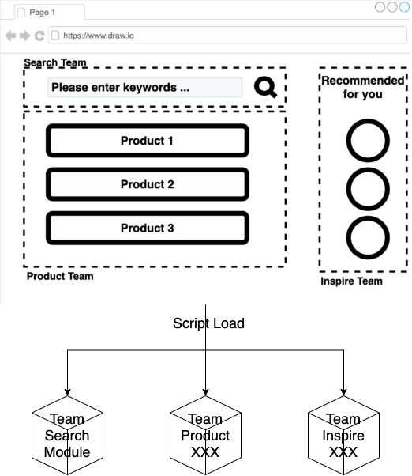

# クライアントサイド組成 - チュートリアル {#client-side-composition-tutorial}



```html
<!-- team-composite/index.html -->
<team-search-text .title="Text"></team-search-text>
<script type="module" src="./search/team-search-text.js" defer></script>
```

```javascript
// team-search-text/index.js
export { TeamSearchText } from './src/TeamSearchText.js';
```

```javascript
// team-search-text/src/TeamSearchText.js
import { html, css, LitElement } from 'lit-element';

export class TeamSearchText extends LitElement {
  static get properties() {
    return {
      title: { type: String },
    };
  }
  constructor() {
    super();
    this.title = 'Text';
  }
  render() {
    return html`<div>Team Search ${this.title}</div>`;
  }
}
```

