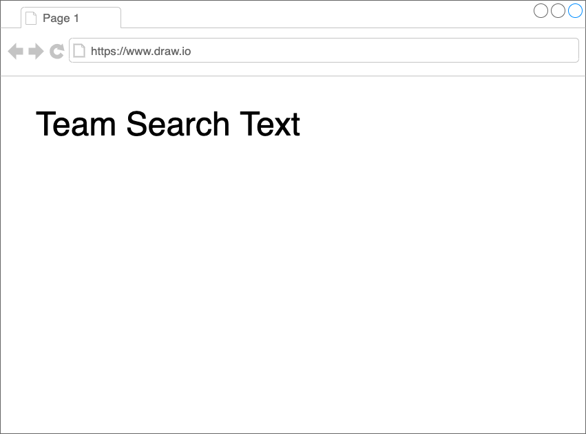

# 最小構成 {#minimum-set}

まず一番簡単な最小構成のクライアントサイド組成を説明する。
説明する順は、次のとおりだ。

1. 組成の説明
2. フラグメントの説明
3. 結果

<!-- textlint-disable -->

サンプルコードは、[こちら](https://github.com/Silver-birder/Introduction_to_Micro_Frontends/tree/main/contents/tutorial/21_client_side_composition_tutorial/src/02_minimum_set/)。

<!-- textlint-enable -->

## 組成 {#composite}

team-composite/index.html
[include](./src/02_minimum_set/src/team-composite/index.html)

このように、組成するHTMLではフラグメントを読み込む。このフラグメントには、カスタム要素を定義してある。
そのカスタム要素である`team-search-text`を使用している。

## フラグメント {#fragment}

team-search-text/team-search-text.js
[include](./src/02_minimum_set/src/team-search-text/team-search-text.js)

`team-search-text`と呼ばれるカスタム要素を定義している。
`team-search-text`の詳細は、次のとおりである。

team-search-text/src/TeamSearchText.js
[include](./src/02_minimum_set/src/team-search-text/src/TeamSearchText.js)

## 結果 {#results}

その結果、次のような画面が表示される。

