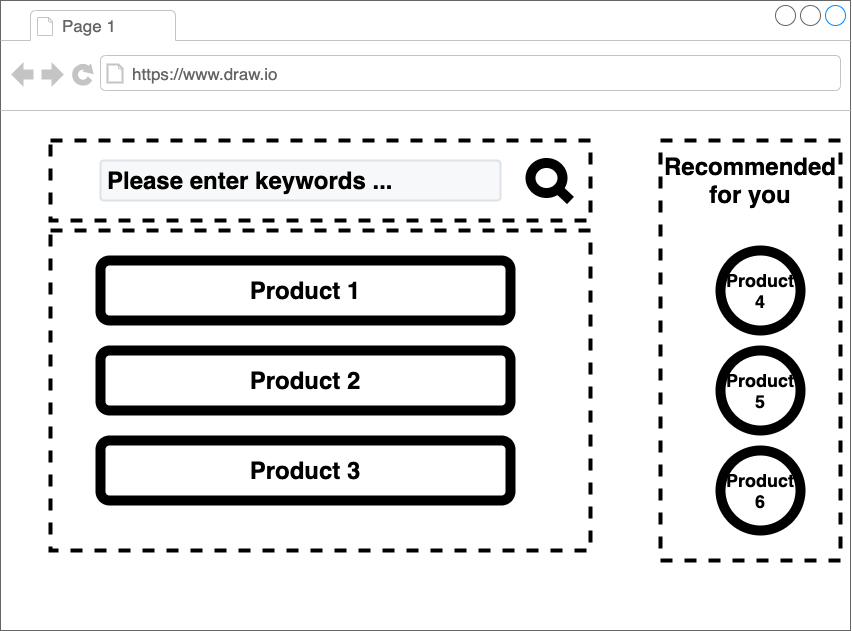

# スタイリング {#styling}

[前章](./02_minimum_set.html)では、単純な組成だけであった。
本章では、目的とするレイアウトに近づける。機能はまだ作らない。

<!-- textlint-disable -->

サンプルコードは、[こちら](https://github.com/Silver-birder/Introduction_to_Micro_Frontends/tree/main/contents/tutorial/21_client_side_composition_tutorial/src/03_styling/)。

<!-- textlint-enable -->

## 組成 {#composite}

team-composite/index.html
[include](./src/03_styling/src/team-composite/index.html)

全体のレイアウトは、`display: grid;`で制御する。
各チームのフラグメントは、個別に`import`し`render`する。

## フラグメント {#fragment}
### team-search-box {#team-search-box}
`team-search-box`は、次のjsから読み込む。

team-search/team-search.js
[include](./src/03_styling/src/team-search/team-search.js)

team-search-text/src/TeamSearchBox.js
[include](./src/03_styling/src/team-search/src/TeamSearchBox.js)

### team-product-list {#team-product-list}
`team-product-list`は、次のjsから読み込む。

team-product/src/team-product.js
[include](./src/03_styling/src/team-product/team-product.js)

team-product/src/TeamProductList.js
[include](./src/03_styling/src/team-product/src/TeamProductList.js)

team-product/src/TeamProductItem.js
[include](./src/03_styling/src/team-product/src/TeamProductItem.js)

`lit-element`を読み込むことが多い。
重複して読み込むコンテンツは、共有化する（もしくはキャッシュ化）など何かしら対処が必要である。

## 結果 {#results}

その結果、次のような画面が表示される。

