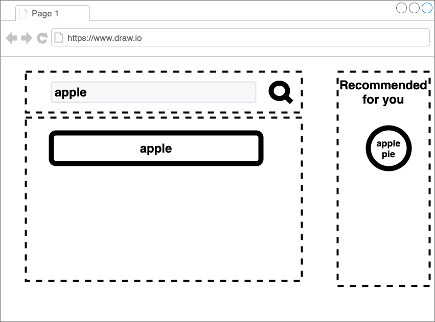

# 機能拡張v.1 {#function-1}

[前章](./03_styling.html)までは、見た目だけで機能はない。
本章では、簡単な検索機能を実装する。そこから、各フラグメントの連携手段を話す。

<!-- textlint-disable -->

サンプルコードは、[こちら](https://github.com/Silver-birder/Introduction_to_Micro_Frontends/tree/main/contents/tutorial/21_client_side_composition_tutorial/src/04_function_1/)。

<!-- textlint-enable -->

## 組成 {#composite}

team-composite/index.html
[include](./src/04_function_1/src/team-composite/index.html)

`new EventBus().launch();`が、各フラグメントのイベントを伝搬するクラスとします。

team-composite/src/eventBus.js
[include](./src/04_function_1/src/team-composite/src/eventBus.js)

`team-search-box`の`submit`（カスタム）イベントを`team-product-list`や`team-inspire-list`へ伝搬します。

## フラグメント {#fragment}
### team-search-box {#team-search-box}

team-search/team-search.js
[include](./src/04_function_1/src/team-search/team-search.js)

team-search-text/src/TeamSearchBox.js
[include](./src/04_function_1/src/team-search/src/TeamSearchBox.js)

検索ボタンをクリックしたら`dispatchEvent(new CustomEvent("submit",{...})`を発火。

### team-product-list {#team-product-list}
`team-product-list`は、次のjsから読み込む。

team-product/src/team-product.js
[include](./src/04_function_1/src/team-product/team-product.js)

team-product/src/TeamProductList.js
[include](./src/04_function_1/src/team-product/src/TeamProductList.js)

このカスタム要素は、`this.addEventListener('update', this._handleUpdate);`で`update`イベントによって更新される。

## 結果 {#results}

その結果、次のような画面が表示される。

## その他 {#other}

今回、URLは何も変化していない。
SEOを考慮するならば、URLと履歴管理について考えないといけない。