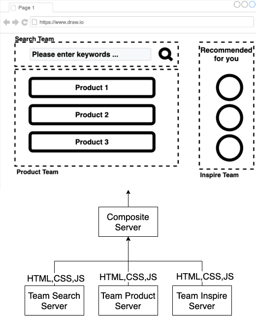

# サーバーサイド組成 - チュートリアル {#server-side-composition-tutorial}

サーバーサイド組成は、次のような構成図を想定する。



先に、組成している部分を紹介する。

```javascript
// team_composite/serve.js
const express = require('express');
const fetch = require('node-fetch');
const app = express();
const port = process.env.PORT || 2000;
const searchHost = process.env.SEARCH_HOST || 'team-search-app:6000';
app.get('/',  async (req, res) => {
  const search = await (await fetch(`http://${searchHost}`)).text();
  res.send(`${search}`);
});
app.listen(port, () => {
  console.log(`Team Composite app listening at http://localhost:${port}`)
});
```

サーバーサイドでレンダリングする際、SEARCH_HOSTへ問い合わせた結果を使っている。
SEARCH_HOSTでは、次のようなサーバーサイドレンダリングをしている。

```javascript
// team_search/serve.js
const express = require('express')
const app = express()
const port = process.env.PORT || 6000;
app.get('/', (req, res) => {
  res.send('Team Search')
})
app.listen(port, () => {
  console.log(`Team Search app listening at http://localhost:${port}`)
})
```

これにより、`Team Search` という結果が返却される。