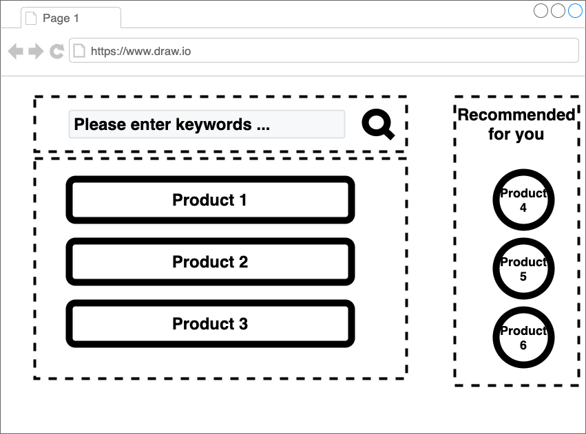

# スタイリング {#styling}

[前章](./02_minimum_set.html)では、単純な組成だけであった。
本章では、目的とするレイアウトに近づける。機能はまだ作らない。

<!-- textlint-disable -->

サンプルコードは、[こちら](https://github.com/Silver-birder/Introduction_to_Micro_Frontends/tree/main/contents/tutorial/22_server_side_composition_tutorial/src/03_styling/)。

<!-- textlint-enable -->

## 組成 {#composite}

team_composite/serve.js
[include](./src/03_styling/src/team_composite/serve.js)

サーバーサイドでは、各フラグメントを取得し、次の`index.ejs`の各変数に組み込む。

team_omposite/views/index.ejs
[import, lang:"html"](./src/03_styling/src/team_composite/views/index.ejs)

## フラグメント {#fragment}

### team-search-box {#team-search-box}

`http://${searchHost}/search-box`は、次のような`serve.js`で返却する。

team_composite/serve.js
[include](./src/03_styling/src/team_search/serve.js)

team_search/views/search-box.ejs
[import, lang:"html"](./src/03_styling/src/team_search/views/search-box.ejs)

各フラグメントのマークアップファイルに、`style`をセットで書いている。
この書き方だと、他のマークアップのスタイルにも影響するやり方なので、注意が必要だ。

### team-product-list {#team-product-list}

`http://${productHost}/product-list`は、次のような`serve.js`で返却する。

team_product/serve.js
[include](./src/03_styling/src/team_product/serve.js)

team_product/views/product-list.ejs
[import, lang:"html"](./src/03_styling/src/team_product/views/product-list.ejs)

team_product/views/product-item.ejs
[import, lang:"html"](./src/03_styling/src/team_product/views/product-item.ejs)

## 結果 {#results}

その結果、次のような画面が表示される。

