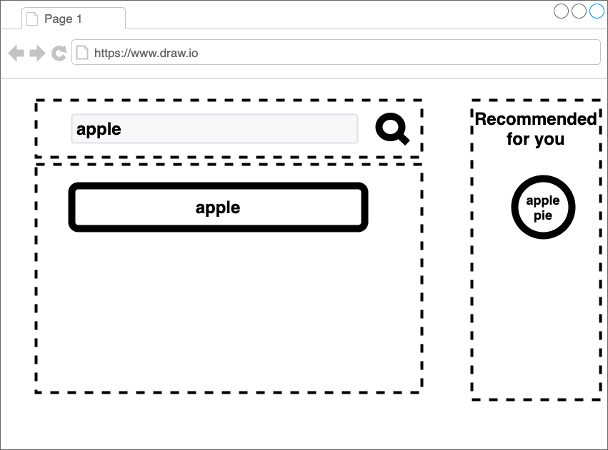

# 機能拡張v.1 {#function-1}

[前章](./03_styling.html)までは、見た目だけで機能はない。
本章では、簡単な検索機能を実装する。

<!-- textlint-disable -->

サンプルコードは、[こちら](https://github.com/Silver-birder/Introduction_to_Micro_Frontends/tree/main/contents/tutorial/22_server_side_composition_tutorial/src/04_function_1/)。

<!-- textlint-enable -->

## フラグメント - team-search-box - {#fragment-team-search-box}

team_search/serve.js
[include](./src/04_function_1/src/team_search/serve.js)

team_search/views/search-box.ejs
[import, lang:"html"](./src/04_function_1/src/team_search/views/search-box.ejs)

`form`を使い、`button`に`type="submit"`と書くことで、サーバーへ検索キーワードを送信するようにする。

## 組成 {#composite}

team_composite/serve.js
[include](./src/04_function_1/src/team_composite/serve.js)

検索キーワードをクエリパラメータ`k`に格納される。
`k`から商品（`items`）をフィルタリングし、その結果を`productList`と`inspireList`へURLのクエリパラメータ（`i`）として渡す。

## フラグメント - team-product-list - {#fragment-team-product-list}

team_product/serve.js
[include](./src/04_function_1/src/team_product/serve.js)

URLのクエリパラメータ`i`より、商品のリストを表示する。

team_product/views/product-list.ejs
[import, lang:"html"](./src/04_function_1/src/team_product/views/product-list.ejs)

## フラグメント - team-inspire-list - {#fragment-team-inspire-list}

team_inspire/serve.js
[include](./src/04_function_1/src/team_inspire/serve.js)

URLのクエリパラメータ`i`より、お勧めする商品を探索し、それを表示する。

team_inspire/views/inspire-list.ejs
[import, lang:"html"](./src/04_function_1/src/team_inspire/views/inspire-list.ejs)

## 結果 {#results}

その結果、次のような画面が表示される。

