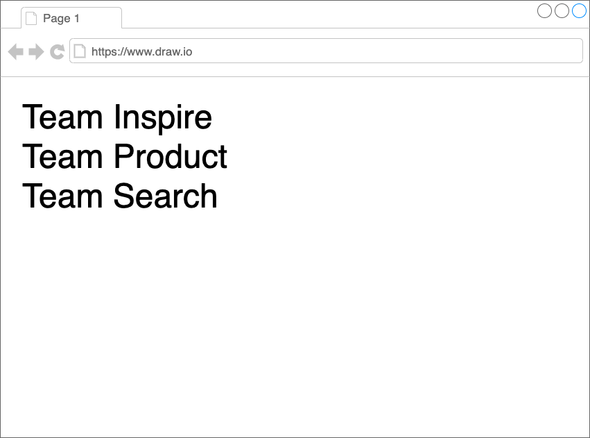

# ビルドタイム組成 - チュートリアル {#build-time-composition-tutorial}

　ビルドタイム組成は、次のような構成図を想定する。


サンプルコードは、[こちら](https://github.com/Silver-birder/micro-frontends-sample-codes/tree/main/pattern/build_time)。

## 最小構成 {#minimum-set}

まず一番簡単な最小構成のビルドタイム組成を説明する。
説明する順は、次のとおりだ。

1. 組成の説明
2. フラグメントの説明
3. 結果

### 組成 {#composite}

```html
<!-- team_composite/public/index.html -->
<div id="root"></div>
```

次に、`#root` に対して `ReactDOM.render` を実行する。

```javascript
// team-composite/src/index.js
import React from 'react';
import ReactDOM from 'react-dom';
import App from './App';

ReactDOM.render(
  <React.StrictMode>
    <App />
  </React.StrictMode>,
  document.getElementById('root')
);
```

そのレンダリングで、`App.js` というものがある。

```javascript
// team_composite/src/App.js
import TeamSearchText from '@bit/silver-birder.micro-frontends-sample-collections.team-search-text'

function App() {
  return (
    <div>
        <TeamSearchText />
    </div>
  );
}
export default App;
```

こちらにあるとおり、`App.js` には `@bit/silver-birder.*` というモジュールをimportしている。

### フラグメント {#fragment}

`@bit/silver-birder.*`のモジュールは、次のようなものである。

```javascript
// team_search/src/components/team-search-text/index.js
import React, { Component } from 'react';

export default class TeamSearchText extends Component {
    render() {
        return (
            <div>
                Team Search
            </div>
        );
    }
}
```

このコードは、[bit.dev](https://bit.dev/)でprivateに公開している。

### 結果 {#results}

その結果、次のような画面が表示される。

