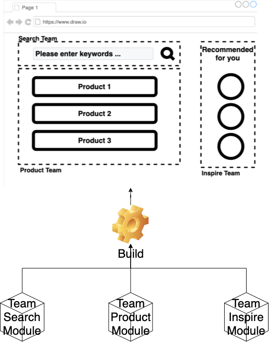

# ビルドタイム組成 - チュートリアル {#build-time-composition-tutorial}



```html
<!-- team_composite/public/index.html -->
<div id="root"></div>
```

```javascript
// team-composite/src/index.js
import React from 'react';
import ReactDOM from 'react-dom';
import App from './App';

ReactDOM.render(
  <React.StrictMode>
    <App />
  </React.StrictMode>,
  document.getElementById('root')
);
```

```javascript
// team_composite/src/App.js
import TeamSearchText from '@bit/silver-birder.micro-frontends-sample-collections.team-search-text'

function App() {
  return (
    <div>
        <TeamSearchText />
    </div>
  );
}
export default App;
```

```javascript
// team_search/src/components/team-search-text/index.js
import React, { Component } from 'react';

export default class TeamSearchText extends Component {
    render() {
        return (
            <div>
                Team Search
            </div>
        );
    }
}
```