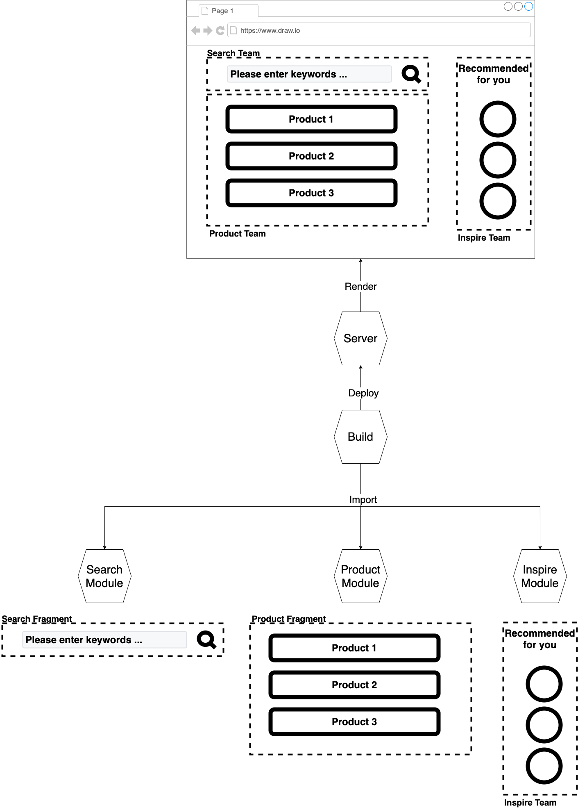

# ビルドタイム組成 - チュートリアル {#build-time-composition-tutorial}

　ビルドタイム組成は、次のような構成図を想定する。

<!-- textlint-disable -->

サンプルコードは、[こちら](https://github.com/Silver-birder/Introduction_to_Micro_Frontends/tree/main/contents/tutorial/23_build_time_composition_tutorial/src/)。

<!-- textlint-enable -->